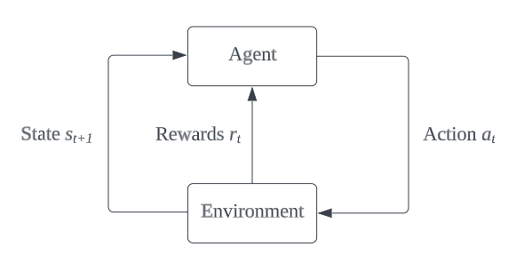
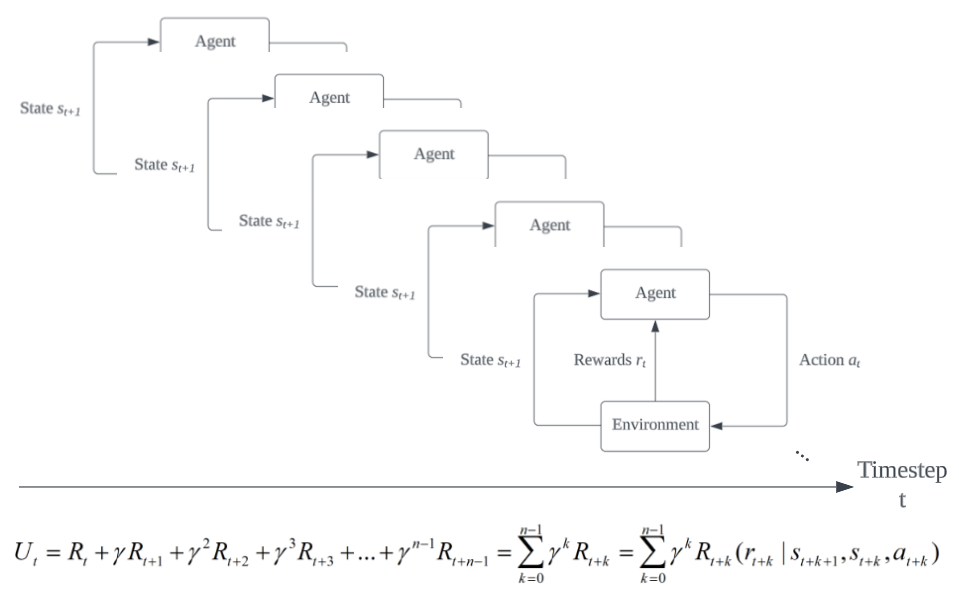
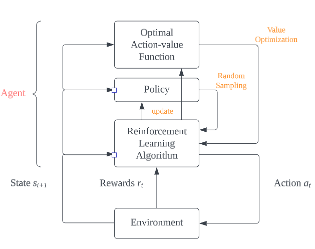

- ## Agent 
	- performs ***action*** (interact with ***environment***)
		- based on ***policy***
	- ### Action: $A\in\left\lbrace{a_{1,}{a_2},}{a_3},\ldots\right\rbrace$
		- ***actions*** performed by the ***agent*** influence the ***environment***
		- may have certain degree of randomness (in determining the action to be performed)
		- $A$ is the random variable of $a$ 
			- i.e., $A$ contains all possible $a$ 
		- #### Policy: $\pi\left(a\left|s\right.\right)=\mathbb{P}\left(A=a\left|S=s\right.\right)$
			- → describes the probability of the agent performing ***action*** $a$ given the ***state*** $s$

- ## Environment
	- a system that the ***agent*** interacts with (such that certain goals can be achieved)
	- ### State: $S\in\left\lbrace{s_{1,}{s_2},}{s_3},\ldots,s_{T}\right\rbrace$
		- ***states*** $s$ of the ***environment*** can be 'observed' by the ***agent***
		- may have certain degree of randomness (in state transition)
		- $S$ is the random variable of $s$ 
			- i.e., $S$ contains all possible $s$ 
		- #### State Transition
			- transition of state: from $s_{t}$ to $s_{t+1}$
				- $t$ is the time-step, $\left\lbrace t\,{\vert}\,0\le t\le T\right\rbrace$
					- $s_{0}$ → initial state of the environment
					- $s_{T}$ → terminal state of the environment  
			- ##### State Transition Function
				- $p\left(s^{\prime}\left|s,a\right.\right)=\mathbb{P}\left(S^{\prime}=s^{\prime}\left|S=s,\right.A=a\right)$
					- $s^{\prime}$ is the next state of $s$
					- $S$ is the random variable of $s$
					- $S^{\prime}$ is the random variable of $s^{\prime}$
					- → describes the probability of the ***environment*** of transitioning into ***state*** $s^{\prime}$ given the previous ***state*** $s$ and the ***action*** $a$ that is performed
	- ### Reward: $r$
		- ***rewards*** are given to the ***agent*** by the ***environment*** to indicate how well the ***agent*** have done
		- #### Reward Function     ^RewardFunction
			- $R\left(r\left|s^{\prime}\right.,s,a\right)=\mathbb{P}\left(r\left|S^{\prime}\right.=s^{\prime},S=s,A=a\right)$
				- → describes the ***reward*** $r$ given to the ***agent*** when the ***state*** is transitioned into $s^{\prime}$ after the ***agent*** performed ***action*** $a$ in ***state*** $s$
				- ***reward*** may have certain degree of randomness (inherited from the randomness of ***state*** and ***action***)
				- $R$ is the random variable of $r$

- ## Agent-Environment Interaction
- 
	1. at time-step $t$, the agent performed action $a_{t}$ in state $s_{t}$
	2. the agent receives rewards $r_{t}$ from the environment
	3. the state of the environment transitioned into $s_{t+1}$

- ### Return: $U$
- 
	- ***return*** → cumulative future ***rewards***
		- i.e., current reward + future rewards
	- $U_{t}=R_1+\gamma R_{t+1}+\gamma^2R_{t+2}+\gamma^3R_{t+3}+\cdots+\gamma^{n-1}R_{t+n-1}$
	- $U_{t}=\sum_{k=0}^{n-1}\gamma^{k}R_{t+k}$
	- $U_{t}=\sum_{k=0}^{n-1}\gamma^{k}R_{t+k}\left(r_{t+k}\left|s_{t+k+1},s_{t+k},a_{t+k}\right.\right)$
		- $\gamma$ → discount rate, $\left\lbrace\gamma\,{\vert}\,0<\gamma<1\right\rbrace$
			- ∵ future rewards are considered less valuable than immediate rewards
	- ***return*** may have certain degree of randomness (inherited from the randomness of ***reward***)

- ### Value
	- Expected ***return*** of performing certain ***action*** in certain ***state***
	- #### Value Function
		- functions modelled by the ***agent*** → estimate how good it is to perform ***action*** $a$ and/or to be in ***state*** $s$
		- ##### Action-value Function: $Q_{\pi}\left(s_{t},a_{t}\right)$ 
			- $Q_{\pi}\left(s_{t},a_{t}\right)=𝔼_{\pi}\left\lbrack U_{t}\left|S_{t}=s_{t},A_{t}=a_{t}\right.\right\rbrack$
			- $Q_{\pi}\left(s_{t},a_{t}\right)=𝔼_{\pi}\left\lbrack\sum_{k=0}^{n-1}\gamma^{k}R_{t+k}\left|S_{t}=s_{t},A_{t}=a_{t}\right.\right\rbrack$
				- → return expected value of $U_{t}$ given $\pi$, $s_{t}$, $a_{t}$
					- → estimate how good it is to perform ***action*** $a_{t}$ given the current ***state*** $s_{t}$ and the current ***policy*** $\pi$
					- → inherently assesses the current ***state*** $s_{t}$
				- by calculating the expected values of $R_{t+1},R_{t+2},R_{t+3},\ldots,R_{t+n-1}$ using $R\left(r\left|s^{\prime}\right.,s,a\right)=\mathbb{P}\left(r\left|S^{\prime}\right.=s^{\prime},S=s,A=a\right)$ 
					- expected values of $S_{t+1},S_{t+2},S_{t+3},\ldots,S_{t+n-1}$ and $A_{t+1},A_{t+2},A_{t+3},\ldots,A_{t+n-1}$ can be calculated by $p\left(s^{\prime}\left|s,a\right.\right)=\mathbb{P}\left(S^{\prime}=s^{\prime}\left|S=s,\right.A=a\right)$ and $\pi\left(a\left|s\right.\right)=\mathbb{P}\left(A=a\left|S=s\right.\right)$ given $s_t$ and $a_t$
			- ###### Optimal Action-value Function: $Q^{\star}\left(s_{t},a_{t}\right)$ ^OptimalAction-valueFunction
				- $Q^{\star}\left(s_{t},a_{t}\right)=\max_{\pi}Q_{\pi}^{}\left(s_{t},a_{t}\right)$
					- → the ***agent*** always chooses the ***action*** than will lead to the maximum value of ***reward***
						- → estimate how good it is to perform ***action*** $a_{t}$ given the current ***state*** $s_{t}$, without considering the current ***policy*** $\pi$
		- ##### State-value Function: $V_{\pi}\left(s_{t}\right)$
			- $V_{\pi}\left(s_{t}\right)=𝔼_{A_{t}}\left\lbrack Q_{\pi}\left(s_{t},A_{t}\right)\right\rbrack$
			- $V_{\pi}\left(s_{t}\right)=\Sigma_{A_{t}}\pi\left(a\left|s_{t}\right.\right)\cdot Q_{\pi}\left(s_{t},a\right)$    {for discrete actions}
				- instead of requiring both the current ***state*** $s_{t}$ and the current ***action*** $a_{t}$ in the ***action-value function*** $Q_{\pi}\left(s_{t},a_{t}\right)$, $V_{\pi}\left(s_{t}\right)$ only takes in the current ***state*** $s_{t}$ since it uses the expected value of $A_{t}$ (i.e., all possible $a_{t}$ are multiplied with the possibility that they would be performed: $\pi\left(a\left|s\right.\right)$ )

- ## Fundamentals of Reinforcement Learning
- 
	- To maximise ***return***, the ***agent*** either controls its ***action*** with *(a.)* an optimal ***policy*** $\pi$, or *(b.)* an ***optimal action-value function*** $Q^{\star}\left(s_{t},a_{t}\right)$
		- a.) with an optimal ***policy*** $\pi$, the best ***action*** $a_{t}$ in ***state*** $s_{t}$ can be obtained by performing random sampling: $a_{t}\sim\pi\left(a_{t}\left|s_{t}\right.\right)$ 
			- → ***agent*** learns by updating its ***policy*** $\pi$ (i.e., ***policy-based learning***)
		- b.) with an ***optimal action-value function*** $Q^{\star}\left(s_{t},a_{t}\right)$, the best ***action*** $a_{t}$ in ***state*** $s_{t}$ can be obtained by $a_{t}=\arg \max_{a}Q^{\star}\left(s_{t},a_{t}\right)$ 
			- → ***agent*** learns by updating its ***value functions*** (i.e., ***value-based learning***)
	- ### Model (of the environment)
		- → mimics the behaviour of the ***environment***
			- → simulate future possible situations
				- → allow ***agent*** to plan
		- ***Model-based learning***
			- involve the use of models
				- i.e., plans before actions
		- ***Model-free learning***
			- doesn't involve the use of models
				- i.e., learns by trial-and-error

- ### Exploration and Exploitation
	- ##### Exploitation
		- take *greedy* actions
		- maximises immediate reward (according to current knowledge of the values of the actions)
		- exploits current knowledge
	- ##### Exploration
		- take *non-greedy* actions
		- improve the current estimation of values of the actions
		- may obtain greater total reward in the long run
	- #### Exploration vs Exploitation
		-  a trade-off in reinforcement learning
	- 

