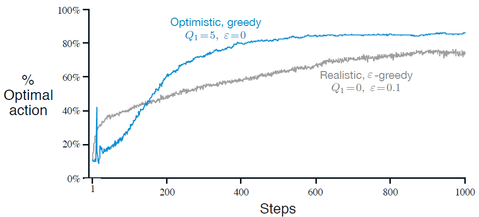
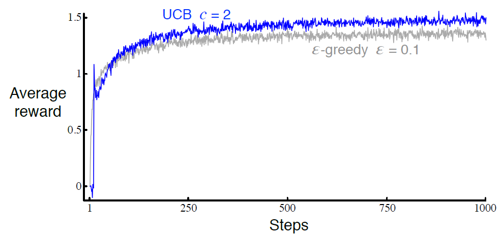

- ## k-Armed Bandit Problem
- 
	- ***state*** of the environment is unchanging 
		- ∴ ***state*** is not considered
		- ∴ ***actions*** always do the same thing to the environment
			- i.e., $a=a_{t}=a_{t+1}=a_{t+2}=\ldots$
	- ***rewards*** of ***actions*** are normally distributed
		- ∴ ***rewards*** of the same ***action*** differs
		- ∴ ***Reward Function***: $R\left(r_{t}\left|a\right.\right)=\mathbb{P}\left(r_{t}\left|A=a\right.\right)$
			- where $r_{t}\sim N\left(\mu_{t},\sigma_{t}\right)$
			- ([[1. Fundamentals#^RewardFunction|link to the section]])
	- → ***Optimal Action-value Function***: $Q^{\star}\left(a_{}\right)=𝔼\left(R_{t}\left|A_{t}=a\right.\right)$
		- ([[1. Fundamentals#^OptimalAction-valueFunction|link to the section]])
	- Let the true value of $Q^{\star}\left(a_{}\right)$ be $q^{\star}\left(a_{}\right)$
	- Let $Q^{\star}_{t}\left(a_{}\right)$ is the estimated value of $q^{\star}\left(a_{}\right)$ at time-step $t$
	- The aim is to bring $Q^{\star}_{t}\left(a_{}\right)$ to be close to $q^{\star}\left(a_{}\right)$, such that the best ***action*** to be taken can be obtained by $a_{}=\arg\max_{a}q^{\star}\left(a_{}\right)$ ideally

- ## Action-value Methods
	- #### Update $Q^{\star}_{t}\left(a_{}\right)$
		- $Q_{t}^{\star}\left(a_{}\right)=\frac{\sum_{i=1}^{t-1}R_{i}\cdot\mathbb{1}_{A_{t}=a}}{\sum_{i=1}^{t-1}\mathbb{1}_{A_{t}=a}}=\frac{\text{sum of rewards when }a\text{ taken prior to }t}{\text{number of times }a\text{ taken prior to }t}$
		- $\mathbb{1}_{A_{t}=a}$ is a Boolean value
			- $\mathbb{1}_{A_{t}=a}$ = 1 when $A_{t}=a$ is *True*
			- $\mathbb{1}_{A_{t}=a}$ = 0 when $A_{t}=a$ is *False*
		- when the denominator is 0, set $Q_{t}^{\star}\left(a_{}\right)$ to some default value
		- when the denominator approaches ∞, $Q_{t}^{\star}\left(a_{}\right)$ → $q^{\star}\left(a_{}\right)$
		- i.e., a ***sample-average method***     ^Sample-average
	- #### Epsilon-Greedy Action Selection     ^Epsilon-GreedyActionSelection
	- 
	- 
		- Advantage of ε-greedy over greedy methods depends on the task
			- e.g., noisier rewards → takes more exploration → ε-greedy performs better  (vice versa)

	- ### Incremental Implementation     ^IncrementalImplementation
		- To simplify notation, we concentrate on a single action
			- $Q_{n}=\frac{R_1+R_2+\cdots+R_{n-1}}{n-1}=\frac{1}{n}\sum_{i=1}^{n-1}R_{i}$
				- where $R_{i}$ is the ***reward*** received after the $i^{\text{th}}$ selection of this ***action***
				- where $Q_n$ is the estimate of the ***value*** of the ***action*** after it has been selected $n-1$ times
		- → instead of retrieving $R_{1}+R_{2}\dots+R_{n-1}$ from storage and adding them up together every time $Q_{n+1}$ is updated, a more efficient way to update $Q_{n+1}$ is by:
			- $Q_{n+1}=\frac{1}{n}\sum_{i=1}^{n}R_{i}$
			- $Q_{n+1}=\frac{1}{n}\left(R_{n}+\sum_{i=1}^{n-1}R_{i}\right)$
			- $Q_{n+1}=\frac{1}{n}\left(R_{n}+\left(n-1\right)\cdot\frac{1}{n-1}\sum_{i=1}^{n-1}R_{i}\right)$
			- $Q_{n+1}=\frac{1}{n}\left(R_{n}+\left(n-1\right)\cdot Q_{n}\right)$
			- $Q_{n+1}=\frac{1}{n}\left(R_{n}+nQ_{n}-Q_{n}\right)$
			- $Q_{n+1}=Q_{n}+\frac{1}{n}\left(R_{n}-Q_{n}\right)$
			- i.e., requires memory only for $Q_{n}$ and $n$, and only small computation for each new reward
		- #### General Formula of Incremental Implementation
			- $\text{New Estimate}←\text{Old Estimate}+\text{StepSize }[\text{ Target}-\text{Old Estimate }]$
				- where $[\text{ Target}-\text{Old Estimate }]$ is an ***error*** in the estimate, which is reduced by taking a step toward the ***target***
	- #### Full Algorithm
	- 

- ## Nonstationary k-Armed Bandit Problem
	- → pandit problems but the reward probability distributions change over time
	- ∴ should give more weight to recent rewards
	- ### Constant Step-Size Parameter
		- $Q_{n+1}=Q_{n}+\alpha\left(R_{n}-Q_{n}\right)$
			- which is modified version of ***Incremental Implementation*** ([[2. Multi-Armed Bandits#^IncrementalImplementation|link to the section]])
			- where $\alpha\in\left(0,1\right\rbrack$  is a constant step-size parameter, $Q_{n+1}$ is the weighted average of past rewards and the initial estimate of $Q_{1}$
			- by expanding the formula, 
				- $Q_{n+1}=Q_{n}+\alpha\left(R_{n}-Q_{n}\right)$
				- $Q_{n+1}=\alpha R_{n}+\left(1-\alpha\right)Q_{n}$
				- $Q_{n+1}=\alpha R_{n}+\left(1-\alpha\right)\left\lbrack\alpha R_{n-1}+\left(1-\alpha\right)Q_{n-1}\right\rbrack$
				- $Q_{n+1}=\alpha R_{n}+\left(1-\alpha\right)\alpha R_{n-1}+\left(1-\alpha\right)^2Q_{n-1}$
				- $Q_{n+1}=\alpha R_{n}+\left(1-\alpha\right)\alpha R_{n-1}+\left(1-\alpha\right)^2\alpha R_{n-2}+$
						$\cdots+\left(1-\alpha\right)^{n-1}\alpha R_1+\left(1-\alpha\right)^{n}Q_1$
				- $Q_{n+1}=\left(1-\alpha\right)^{n}Q_1+\sum_{i=1}^{n}\alpha\left(1-\alpha\right)^{n-i}R_{i}$
					- ∵ $1-\alpha<1$ 
						- ∴ the weight given to $R_{i}$ decreases as the number of intervening rewards increases (from the current time-step)
					- ∵ $\left(1-\alpha\right)^{n-i}$ decreases exponentially as $i$ decreases\
						- ∴ often called ***exponential recency-weighted average***
	- ### Variable Step-Size Parameter     
		- $Q_{n+1}=Q_{n}+\alpha\left(R_{n}-Q_{n}\right)$
			- similar to ***constant step-size parameter***, but $\alpha\in\left(0,1\right\rbrack$  is a varying step-size parameter given by $\alpha_{n}\left(a\right)$ 
				- $\alpha_{n}\left(a\right)$ takes ***action*** $a$ as input, and return the ***step-size parameter*** at time-step $n$ (i.e., $\alpha_{n}$)
	- ### Convergence of $Q_{\infty}$
		- to guarantee $Q_{\infty}$ converges to the real action values, by stochastic approximation theory, two conditions are required:
			1. $\sum_{n=1}^{\infty}\alpha_{n}\left(a\right)=\infty$
				- → the steps are large enough to eventually overcome any initial conditions or random fluctuations
			2. $\sum_{n=1}^{\infty}\alpha_{n}^2\left(a\right)<\infty$
				- → the steps will eventually become small enough to assure convergence
		- ***Sample-average*** ([[2. Multi-Armed Bandits#^Sample-average|link to the section]]): 
			- $\alpha_{n}\left(a\right)=\frac{1}{n}$ 
			- → both conditions are met
		- ***Constant step-size parameter***: 
			- $\alpha_{n}\left(a\right)=\alpha$ 
			- → the second condition is not met
			- ∴ $Q_{\infty}$ never completely converge, but continue to vary in response to the most recently received rewards → more desirable in nonstationary environments (more common in reinforcement learning)

- ## Optimistic Initial Values
	- methods maybe *biased* by their initial estimates $Q_1\left(a\right)$
		- e.g., methods using constant/variable step-size parameter
	- although the bias decreases over time, but is still permanent
	- → could be used to supply some prior knowledge about what level of rewards can be expected
	- → could also be used to encourage exploration
		- ∵ optimistic initial estimation causes 'disappointment', and encourages action-value methods to explore other actions with higher rewards
		- e.g., using ***optimistic initial value*** in a stationary problem:
		- 
	- ### Limitation
		- not well suited to nonstationary problem
		- ∵ only encourage exploration at the beginning

- ## Upper-Confidence-Bound (UCB) Action Selection
	- although ε-greedy action selection ([[2. Multi-Armed Bandits#^Epsilon-GreedyActionSelection|link to the section]]) forces the non-greedy actions to be tried, those actions are picked randomly & indiscriminately 
	- optimal actions to be chosen should be:
		1. have high estimated action-values
		2. high uncertainties in those action-value estimations
	- ∴ one effective way of selecting non-greedy action is by UCB action selection:
		- $A_{t}=\operatorname*\arg\max_{a}\left\lbrack Q_{t}\left(a\right)+c\sqrt{\frac{\ln t}{N_{t}\left(a\right)}}\text{ }\right\rbrack$
			- where $t$ is the current time-step
			- where $N_{t}\left(a\right)$ is the number of times that action $a$ has been selected prior to time-step $t$
			- where $c$ is a constant that controls the degree of exploration, $c>0$
			- → at the beginning, actions that have not been selected have $N_{t}\left(a\right)=0$
				- ∴ $c\sqrt{\frac{\ln t}{N_{t}\left(a\right)}}\text{ → }\infty$, hence will be selected
			- → after a while, when an action have been selected a few times, $N_{t}\left(a\right)=0$ increases
				- ∴ $c\sqrt{\frac{\ln t}{N_{t}\left(a\right)}}$ decreases, hence will be less likely to be selected
			- → after an action have not been selected for a while,  $\ln{t}$ increases but $N_{t}\left(a\right)$ remains constant
				- ∴ $c\sqrt{\frac{\ln t}{N_{t}\left(a\right)}}$ increases, hence will be more likely to be selected
			- → after many time-steps, $N_{t}\left(a\right)\text{ → }\infty$ faster than $\ln{t}\text{ → }\infty$
				- ∴ $c\sqrt{\frac{\ln t}{N_{t}\left(a\right)}}\text{ → }0$, hence will be selected only according to $Q_{t}\left(a\right)$
		- e.g., using ***UCB action selection*** in a stationary problem:
		- 
	- ### Limitations
		- difficulty in dealing with nonstationary problems
		- difficulty in dealing with large state spaces
		- ∴ more difficult than ε-greedy to extend beyond bandits to the more general problems