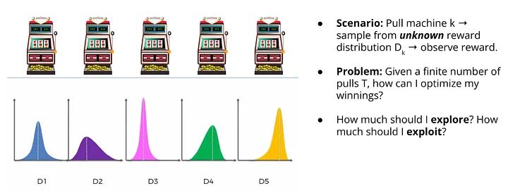
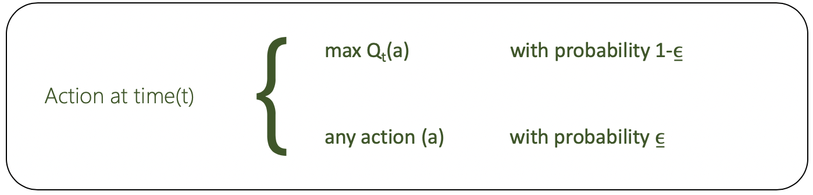
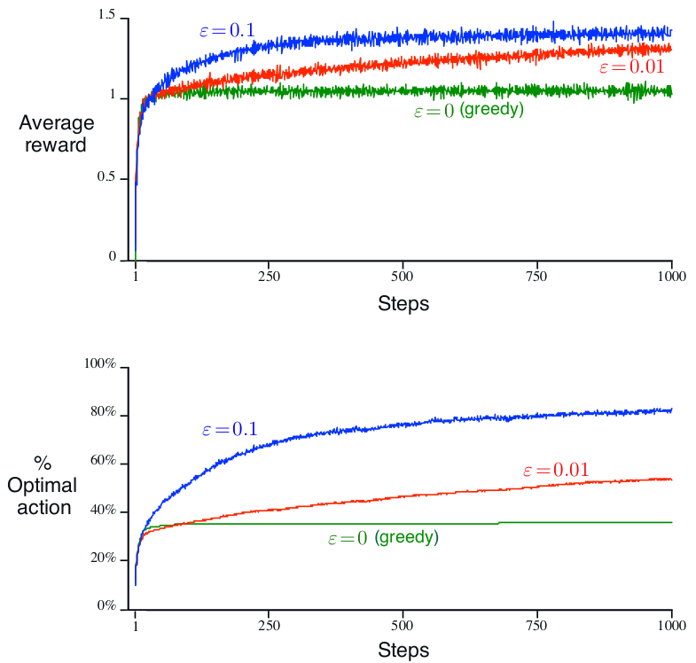
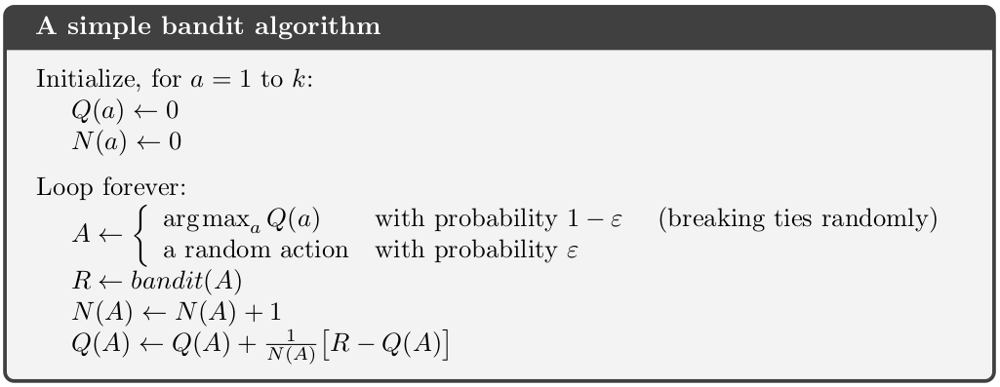

- ## k-Armed Bandit Problem
- 
	- ***state*** of the environment is unchanging 
		- ∴ ***state*** is not considered
		- ∴ ***actions*** always do the same thing to the environment
			- i.e., $a=a_{t}=a_{t+1}=a_{t+2}=\ldots$
	- ***rewards*** of ***actions*** are normally distributed
		- ∴ ***rewards*** of the same ***action*** differs
		- ∴ ***Reward Function***: $R\left(r_{t}\left|a\right.\right)=\mathbb{P}\left(r_{t}\left|A=a\right.\right)$
			- where $r_{t}\sim N\left(\mu_{t},\sigma_{t}\right)$
			- ([[1. Fundamentals#^RewardFunction|link to the section]])
	- → ***Optimal Action-value Function***: $Q^{\star}\left(a_{}\right)=𝔼\left(R_{t}\left|A_{t}=a\right.\right)$
		- ([[1. Fundamentals#^OptimalAction-valueFunction|link to the section]])
	- Let the true value of $Q^{\star}\left(a_{}\right)$ be $q^{\star}\left(a_{}\right)$
	- Let $Q^{\star}_{t}\left(a_{}\right)$ is the estimated value of $q^{\star}\left(a_{}\right)$ at time-step $t$
	- The aim is to bring $Q^{\star}_{t}\left(a_{}\right)$ to be close to $q^{\star}\left(a_{}\right)$, such that the best ***action*** to be taken can be obtained by $a_{}=\arg\max_{a}q^{\star}\left(a_{}\right)$ ideally

- ## Action-value Methods
	- #### Update $Q^{\star}_{t}\left(a_{}\right)$
		- $Q_{t}^{\star}\left(a_{}\right)=\frac{\sum_{i=1}^{t-1}R_{i}\cdot\mathbb{1}_{A_{t}=a}}{\sum_{i=1}^{t-1}\mathbb{1}_{A_{t}=a}}=\frac{\text{sum of rewards when }a\text{ taken prior to }t}{\text{number of times }a\text{ taken prior to }t}$
		- $\mathbb{1}_{A_{t}=a}$ is a Boolean value
			- $\mathbb{1}_{A_{t}=a}$ = 1 when $A_{t}=a$ is *True*
			- $\mathbb{1}_{A_{t}=a}$ = 0 when $A_{t}=a$ is *False*
		- when the denominator is 0, set $Q_{t}^{\star}\left(a_{}\right)$ to some default value
		- when the denominator approaches ∞, $Q_{t}^{\star}\left(a_{}\right)$ → $q^{\star}\left(a_{}\right)$
		- i.e., a ***sample-average method***
	- #### Epsilon-Greedy Action Selection
	- 
	- 
		- Advantage of ε-greedy over greedy methods depends on the task
			- e.g., noisier rewards → takes more exploration → ε-greedy performs better  (vice versa)

	- ### Incremental Implementation
		- To simplify notation, we concentrate on a single action
			- $Q_{n}=\frac{R_1+R_2+\cdots+R_{n-1}}{n-1}=\frac{1}{n}\sum_{i=1}^{n-1}R_{i}$
				- where $R_{i}$ is the ***reward*** received after the $i^{\text{th}}$ selection of this ***action***
				- where $Q_n$ is the estimate of the ***value*** of the ***action*** after it has been selected $n-1$ times
		- → instead of retrieving $R_{1}+R_{2}\dots+R_{n-1}$ from storage and adding them up together every time $Q_{n+1}$ is updated, a more efficient way to update $Q_{n+1}$ is by:
			- $Q_{n+1}=\frac{1}{n}\sum_{i=1}^{n}R_{i}$
			- $Q_{n+1}=\frac{1}{n}\left(R_{n}+\sum_{i=1}^{n-1}R_{i}\right)$
			- $Q_{n+1}=\frac{1}{n}\left(R_{n}+\left(n-1\right)\cdot\frac{1}{n-1}\sum_{i=1}^{n-1}R_{i}\right)$
			- $Q_{n+1}=\frac{1}{n}\left(R_{n}+\left(n-1\right)\cdot Q_{n}\right)$
			- $Q_{n+1}=\frac{1}{n}\left(R_{n}+nQ_{n}-Q_{n}\right)$
			- $Q_{n+1}=Q_{n}+\frac{1}{n}\left(R_{n}-Q_{n}\right)$
			- i.e., requires memory only for $Q_{n}$ and $n$, and only small computation for each new reward
		- #### General Formula of Incremental Implementation
			- $\text{New Estimate}←\text{Old Estimate}+\text{StepSize }[\text{ Target}-\text{Old Estimate }]$
				- where $[\text{ Target}-\text{Old Estimate }]$ is an ***error*** in the estimate, which is reduced by taking a step toward the ***target***
	- #### Full Algorithm
	- 

