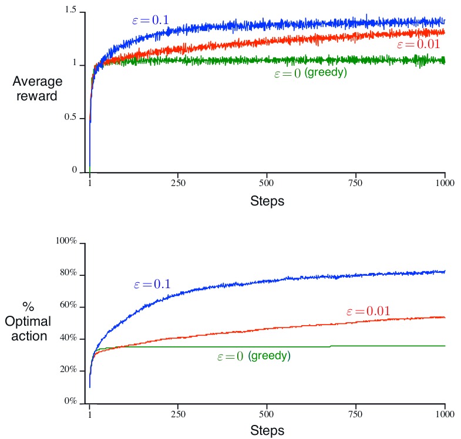

- ## k-Armed Bandit Problem
- 
	- ***state*** of the environment is unchanging 
		- ∴ ***state*** is not considered
		- ∴ ***actions*** always do the same thing to the environment
			- i.e., $a=a_{t}=a_{t+1}=a_{t+2}=\ldots$
	- ***rewards*** of ***actions*** are normally distributed
		- ∴ ***rewards*** of the same ***action*** differs
		- ∴ ***[[1_Fundamentals#^RewardFunction|Reward Function]]***: $R\left(r_{t}\left|a\right.\right)=\mathbb{P}\left(r_{t}\left|A=a\right.\right)$
			- where $r_{t}\sim N\left(\mu_{t},\sigma_{t}\right)$
	- → ***[[1_Fundamentals#^OptimalAction-valueFunction|Optimal Action-value Function]]***: $Q^{\star}\left(a_{}\right)=𝔼\left(R_{t}\left|A_{t}=a\right.\right)$
	- Let the true value of $Q^{\star}\left(a_{}\right)$ be $q^{\star}\left(a_{}\right)$
	- Let $Q^{\star}_{t}\left(a_{}\right)$ is the estimated value of $q^{\star}\left(a_{}\right)$ at time-step $t$
	- The aim is to bring $Q^{\star}_{t}\left(a_{}\right)$ to be close to $q^{\star}\left(a_{}\right)$, such that the best ***action*** to be taken can be obtained by $a_{}=\arg\max_{a}q^{\star}\left(a_{}\right)$ ideally

- ## Action-value Methods
	- #### Update $Q^{\star}_{t}\left(a_{}\right)$
		- $$Q_{t}^{\star}\left(a_{}\right)=\frac{\sum_{i=1}^{t-1}R_{i}\cdot\mathbb{1}_{A_{t}=a}}{\sum_{i=1}^{t-1}\mathbb{1}_{A_{t}=a}}=\frac{\text{sum of rewards when }a\text{ taken prior to }t}{\text{number of times }a\text{ taken prior to }t}$$
		- $\mathbb{1}_{A_{t}=a}$ is a Boolean value
			- $\mathbb{1}_{A_{t}=a}$ = 1 when $A_{t}=a$ is *True*
			- $\mathbb{1}_{A_{t}=a}$ = 0 when $A_{t}=a$ is *False*
		- when the denominator is 0, set $Q_{t}^{\star}\left(a_{}\right)$ to some default value
		- when the denominator approaches ∞, $Q_{t}^{\star}\left(a_{}\right)$ → $q^{\star}\left(a_{}\right)$
		- i.e., a ***sample-average method***
	- #### Epsilon-Greedy Action Selection
	- 
	- 
		- Advantage of ε-greedy over greedy methods depends on the task
			- e.g., noisier rewards → takes more exploration → ε-greedy performs better  (vice versa)